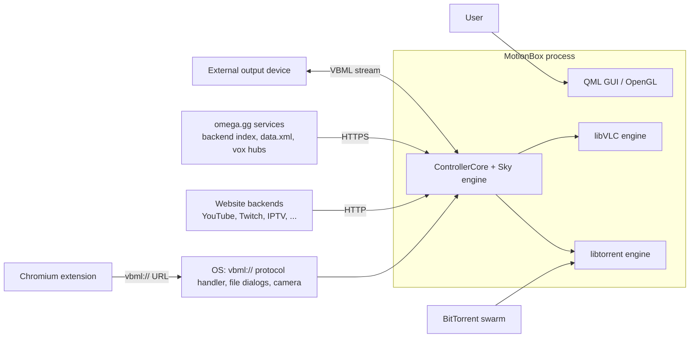
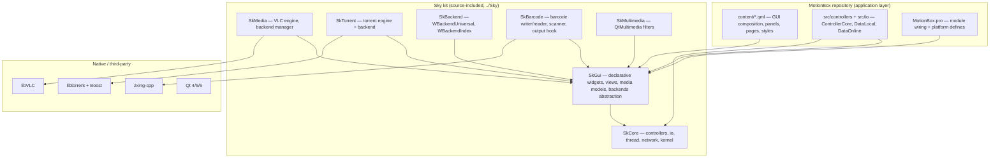
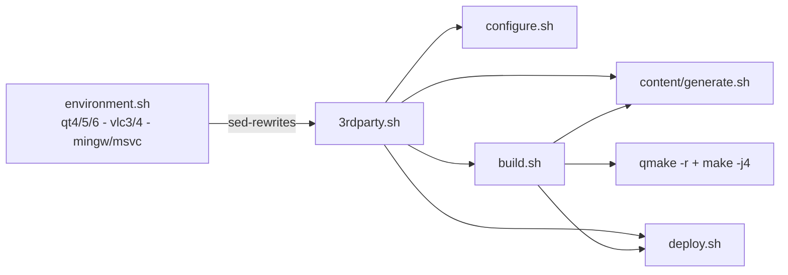

# MotionBox — Software Design Document

| | |
|---|---|
| **Product** | MotionBox — Video Browser for desktop computers |
| **Version documented** | 3.0.0-3 (`CORE_VERSION` in `src/controllers/ControllerCore.cpp`; changelogs reach 3.1.0) |
| **License** | GPLv3, dual-tracked with a private license for MotionBox licensees |
| **Author / origin** | Benjamin Arnaud (bunjee) and the MotionBox authors, [omega.gg](https://omega.gg/MotionBox) |
| **Repository** | `https://github.com/Rojman1984/MotionBox` (upstream: `omega-gg/MotionBox`) |
| **Document date** | September 2026 |

---

## Table of contents

1. [Introduction](#1-introduction)
2. [System overview](#2-system-overview)
3. [Architecture](#3-architecture)
4. [Runtime architecture](#4-runtime-architecture)
5. [Application-layer C++ components](#5-application-layer-c-components)
6. [Media and backend pipeline](#6-media-and-backend-pipeline)
7. [VideoTag and barcode subsystem](#7-videotag-and-barcode-subsystem)
8. [GUI design (QML layer)](#8-gui-design-qml-layer)
9. [Data and persistence](#9-data-and-persistence)
10. [External integrations](#10-external-integrations)
11. [Build, configuration and deployment](#11-build-configuration-and-deployment)
12. [Platform and portability strategy](#12-platform-and-portability-strategy)
13. [Quality attributes](#13-quality-attributes)
14. [Known limitations and technical debt](#14-known-limitations-and-technical-debt)
15. [Glossary](#15-glossary)

---

## 1. Introduction

### 1.1 Purpose

MotionBox is a **video browser**: a desktop application that aggregates, streams, organizes and
shares video from many online sources (YouTube, Dailymotion, Vimeo, Twitch, TikTok, Twitter,
Facebook, Odysee, PeerTube, SoundCloud, Last.fm, IPTV playlists, BitTorrent, TMDB, DuckDuckGo and
the omega.gg "vox" hub) inside a multi-tab GUI, without ads. This document describes the software
design of the MotionBox codebase: its architecture, component responsibilities, data model,
persistence, build system and platform strategy.

### 1.2 Scope

This repository (`MotionBox`) is the **application layer** of a two-tier system. The bulk of the
reusable engine — windowing, declarative widgets, media abstraction, networking, torrent, barcode —
lives in the sibling **Sky kit** (`../Sky`, cloned at build time from `github.com/omega-gg/Sky`) and
is *source-included* into the MotionBox binary (there is no Sky shared library). This document
covers both layers where they interact, but emphasizes what is actually defined in this repository.

Application-specific code is deliberately small:

| App-layer code | Files | Size |
|---|---|---|
| Entry point | `src/global/main.cpp` | 61 lines |
| Composition root / controller | `src/controllers/ControllerCore.{h,cpp}` | ~2 130 lines |
| Settings persistence | `src/io/DataLocal.{h,cpp}`, `DataLocal_patch.cpp` | ~1 460 lines |
| Remote data | `src/io/DataOnline.{h,cpp}` | ~290 lines |
| QML GUI | `content/*.qml` (~100 files) | ~8 500 lines |

Everything else referenced by `MotionBox.pro` comes from Sky through thirteen module `.pri` files
under `src/` (`controllers.pri`, `kernel.pri`, `io.pri`, `thread.pri`, `network.pri`,
`image.pri`, `graphicsview.pri`, `declarative.pri`, `models.pri`, `media.pri`, `vlc.pri`,
`torrent.pri`) plus six third-party wrappers under `src/3rdparty/`.

### 1.3 Intended audience

Maintainers of MotionBox/Sky, and engineers evaluating the codebase. Familiarity with Qt/QML is
assumed.

### 1.4 Key concepts

- **VBML** (Video Browser Markup Language) — omega.gg's data language for describing video
  resources, playlists and *backends*. A `.vbml` file can encode a search query, a playlist, or the
  script-like definition of how to scrape/query a site. VBML is the interchange format for
  everything MotionBox plays, saves and shares.
- **Backend** — a VBML-defined site adapter (YouTube, Twitch, IPTV, …) shipped as loose files in a
  `backend/` folder with an `index.vbml` index. Backends are data, not code: they can be updated
  without recompiling the application.
- **VideoTag** — a QR-code-like image that encodes a VBML hash (a shareable "link" to a track,
  playlist or custom query), renderable by `WBarcodeWriter` (zxing-cpp) and readable back through
  the camera.
- **Output** — streaming the current playback to a remote player/device through a backend *hook*
  (`WHookOutputBarcode`), part of the omega.gg "tevolution" ecosystem; paired either by a VBML
  stream URL or by a 4-digit "Magic Number" code.

---

## 2. System overview

### 2.1 Product capabilities

- **Browse & search** many sites through pluggable VBML backends; unified search bar with Google
  completion (`WModelCompletionGoogle`).
- **Multi-tab playback** — up to 32 video tabs (`WTabsTrack`), each with a bookmark history
  (previous/next track navigation).
- **Organize** — a persistent "Library" of playlists/folders, "Feeds" (history, suggested, recent,
  interactive hubs), and "Related" (per-track recommendations with periodic refresh).
- **Stream via BitTorrent** — libtorrent-backed playback with configurable connections, speed
  limits and cache.
- **Share** — save/open `.vbml` files, copy VBML links, generate and scan **VideoTag** QR codes.
- **Output** — send playback to external outputs (VBML streams / paired devices).
- **Subtitles** — search and load subtitles (OpenSubtitles), local subtitle files, drag & drop.
- **Camera** — scan VideoTags from the device camera (Qt6 multimedia + zxing-cpp).
- **Media keys, keyboard-driven UI** (complete F1–F12 panel map), frameless custom window chrome.

### 2.2 System context



### 2.3 Technology stack

| Concern | Technology |
|---|---|
| Language | C++17 (`CONFIG += c++1z`), QML |
| UI framework | Qt 4.8.7 / 5.15.2 / 6.10.1 (single codebase, `QT_4`/`QT_5`/`QT_6` + `QT_OLD`/`QT_NEW` compile-time branches) |
| Rendering | QML scene graph over OpenGL (software fallback via commented `SK_SOFTWARE`) |
| Video playback | libVLC 2.2+ (VLC 3 by default, VLC 4 variant supported) |
| Torrent | libtorrent-rasterbar 1.1+ with Boost.System |
| Barcode encode/decode | zxing-cpp (compiled from Sky's `SkBarcode/3rdparty`) |
| Frameless window (Qt6 win/mac) | qwindowkit (`SK_WINDOW_NATIVE`) |
| Compression | zlib + QuaZip (source-included from Sky) |
| Charset detection | libcharsetdetect (uchardet models, source-included) |
| Single instance | QtSingleApplication (source-included) |
| Build | qmake (recursive) + POSIX shell scripts; MSVC/jom or MinGW/make; Qt Quick compiler in release |

---

## 3. Architecture

### 3.1 Layered view



**Design decision — source injection.** `MotionBox.pro` sets `SK = ../Sky` and every module `.pri`
lists Sky headers/sources by path (`$$SK_GUI/media/WPlayer.cpp`, …). The `SK_*_LIBRARY` defines
flip Sky's export macros to "building-the-library" mode. Consequences:

- One binary contains everything; no Sky runtime dependency.
- The app can *patch* Sky classes at link time: Sky ships MotionBox-specific `_patch.cpp`
  translation units (`WControllerPlaylist_patch.cpp`, `WPlaylist_patch.cpp`, `WTabTrack_patch.cpp`)
  that are included only by MotionBox's `.pri` files — the same pattern MotionBox itself uses for
  `DataLocal_patch.cpp`.
- Sky is a hard, version-coupled dependency: MotionBox is essentially a *configuration* of Sky.

### 3.2 Module map of this repository

| Module (`src/*.pri`) | App files | Purpose (Sky classes pulled in) |
|---|---|---|
| `global` | `main.cpp` | Entry point; `Sk`/`Sk_p` global helpers |
| `controllers` | `ControllerCore.{h,cpp}` | Controller framework (`WController*`), playlist/media/torrent controllers |
| `io` | `DataLocal.*`, `DataLocal_patch.cpp`, `DataOnline.*` | Loaders (`WLoaderVbml`, `WLoaderBarcode`, `WLoaderNetwork`, `WLoaderTorrent`), `WLocalObject` persistence, `WCache`, `WZipper/WUnzipper`, `WYamlReader`, `WBackendIndex`, `WBarcodeWriter/Reader`, `WFileWatcher` |
| `kernel` | — | `WApplication`, `WAbstractTabs/Tab`, action/input cues, crypto, regex |
| `thread` | — | `WAbstractThreadAction/Reply`, `WThreadActions` — queued work on a worker thread |
| `network` | — | `WBroadcastClient/Server` |
| `image` | — | `WPixmapCache`, `WImageFilter(Color)` |
| `graphicsview` | — | `WView`, `WWindow`, `WViewResizer/Drag`, `WResizer`, `WTextureVideo` (Qt6) |
| `declarative` | — | `WDeclarative*` item library (images, SVG, borders, lists, player, ambient, scanner), drop/key events |
| `models` | — | `WModelList/Range/Tabs/Contextual/Output`, `WModelLibraryFolder(Filtered)`, `WModelPlaylist(Filtered)`, `WModelCompletionGoogle` |
| `media` | — | `WTrack`, `WPlaylist`, `WLibraryItem/Folder(FolderRelated)`, `WPlayer`, `WTabsTrack/WTabTrack`, `WBackendNet`, `WBackendManager`, `WBackendVlc`, `WBackendSubtitle`, `WBackendUniversal`, `WBackendTorrent`, hooks (`WAbstractHook`, `WHookOutput`, `WHookOutputBarcode`, `WHookTorrent`), loaders (suggest/recent/tracks) |
| `vlc` | — | `WVlcEngine`, `WVlcPlayer`, `WVlcAudio` — the concrete libVLC engine |
| `torrent` | — | `WTorrentEngine` — the concrete libtorrent engine |

Third-party wrappers (`src/3rdparty/*.pri`): `qtsingleapplication`, `zlib`, `quazip`,
`libcharsetdetect`, `zxing-cpp` (~150 sources), `qwindowkit` (win/mac Qt6 only).

### 3.3 The four data domains

`ControllerCore` exposes exactly four persistent `WLibraryFolder` roots, identified by fixed IDs —
these IDs are part of the design contract (the QML dispatches on `tab.idFolderRoot`, and
`DataLocal_patch` hard-deletes folders 3 and 4 on config migration):

| ID | Object | Meaning |
|---|---|---|
| 1 | `WLibraryFolder` → exposed as `core.library` | User library: playlists and folders |
| 2 | `WLibraryFolder` → `core.feeds` | Built-in feeds: `tracks` (history), `suggest`, `recent`, `interactive` (max 100 items) |
| 3 | `WLibraryFolder` → `core.backends` | Backend/browse folder: `browser` entry + one searchable item per backend from `index.vbml` |
| 4 | `WLibraryFolderRelated` → `core.related` | "Related" recommendations for the current track (id 4) |

---

## 4. Runtime architecture

### 4.1 Process model

- Single instance: `QtSingleApplication` (Sky sources) forwards a second launch's arguments —
  including `vbml://` URLs — to the running instance.
- `main.cpp` creates the application via `WApplication::create(argc, argv)` (QApplication on Qt4,
  QGuiApplication otherwise; widgets are added on Qt6 desktop for `QFileDialog`), returns early if
  another instance handled the arguments.

### 4.2 Startup sequence

```mermaid
sequenceDiagram
    participant M as main()
    participant W as WApplication (Sky)
    participant C as ControllerCore
    participant Q as QML (Main.qml → Splash → Gui.qml)

    M->>W: WApplication::create(argc, argv)
    W-->>M: app (or null if another instance)
    M->>C: W_CREATE_CONTROLLER(ControllerCore)
    M->>C: applyArguments() [desktop: argv[1]]
    M->>W: sk->setQrc(false)  (dev builds read QML from disk)
    M->>W: sk->startScript()  → loads Main.qml
    Q->>C: window.onFadeIn → core.load()
    C-->>C: create storage, controllers, cache, loaders, tabs, folders, index
    Q->>Q: st.applyStyle(local.style); loader.source = "Gui.qml"
```

`ControllerCore` is constructed *before* the QML engine starts (needed for QML type registration
and context properties), but `load()` is deferred until the first window frame (`onFadeIn`) so the
splash screen can paint immediately.

### 4.3 QML ↔ C++ bridge

Two mechanisms, both set up in the `ControllerCore` constructor and `load()`:

**1. Context properties** (`wControllerDeclarative->setContextProperty`):

| Name | Type | Role in QML |
|---|---|---|
| `sk` | `WControllerApplication` | App services: clipboard, share, vibrate, screensaver/cursor control, `processEvents`, `restartScript` (dev live-reload), version, messages |
| `core` | `ControllerCore` | The application API — see §5.1 |
| `local` | `DataLocal` | The entire persisted settings store — see §5.2 |
| `online` | `DataOnline` | Remote version / announcement feed (deploy builds) |
| `controllerFile` | `WControllerFile` | File URLs, storage paths, `readAll`, application log |
| `controllerNetwork` | `WControllerNetwork` | URL/fragment algebra, connectivity check |
| `controllerPlaylist` | `WControllerPlaylist` | ~33 helpers: source/playlist factory, VBML hash and URI conversion, backend resolution, text query parsing, file filters, VBML file association |

**2. Registered QML types** (module `Sky 1.0`, ~50 `qmlRegisterType` calls in the constructor):
creatable widgets/items (`SkyImage`, `SkyBorderImage`, `TextSvg`, `Player`, `Ambient`, `Scanner`,
`ModelPlaylist`, `ModelLibraryFolder`, `Playlist`, `LibraryFolder`, `TabTrack`, `BackendVlc`,
`BackendSubtitle`, …) and uncreatable value/abstract types (`Sk`, `AbstractBackend`, `HookOutput`,
`LibraryItem`, `LocalObject`, …).

**Direction of flow.** QML → C++ is property writes and `Q_INVOKABLE` calls; C++ → QML is almost
exclusively signals consumed via `Connections { target: … }` blocks (e.g. mirroring
`player.speed/volume/repeat/output/quality/fillMode` into `local.*` in `Gui.qml`, or
`core.onTagUpdated(image, text)` feeding the VideoTag preview).

---

## 5. Application-layer C++ components

### 5.1 `ControllerCore` — composition root and application API

`src/controllers/ControllerCore.{h,cpp}` (extends Sky's `WController`) owns every subsystem and is
the single place where the application is assembled. Notable members:

- **Player factory** — `applyBackend(WDeclarativePlayer *)`: creates the concrete backend
  (`WBackendTorrent`, or `WBackendManager` when built with `SK_NO_TORRENT`), installs it on the
  player, and — *first arrived first served* — creates the single `WHookOutputBarcode` hook and
  exposes it as `core.output`. Called for the main player **and** the ambient player
  (`PageAmbient.qml`).
- **Deferred bootstrap** — `load()`: creates the storage folder, message handler/log, the
  `WControllerPlaylist`, `WControllerMedia` and `WControllerTorrent` controllers, a `WCache`
  (100 MB file cache; 30 MB pixmap cache), registers query-type loaders (`TypeVbml` → `WLoaderVbml`,
  `TypeImage` → `WLoaderBarcode`, `TypeTorrent` → `WLoaderTorrent` shared between playlist and
  torrent controllers), applies proxy and torrent options from `DataLocal`, creates the tabs and
  the four library folders (§3.3), wires the backend index, installs the remaining context
  properties, and starts a 1-minute timer that bookmarks the current tab and refreshes cover/preview
  dates.
- **Search flow** — `loadTrack(playlist, text)`: if the text is a URI it is inserted directly as a
  source; otherwise the matching backend id is resolved (falling back to the search backend), a
  temporary `WPlaylist` runs the backend query (`createSource(id, "search", "tracks", query)`), and
  on completion the first result replaces the placeholder track in the target playlist
  (`onQueryEnded`).
- **Links flow** — `loadLinks(source, safe)` → `WControllerMedia::getMedia(...)` → `onMediaLoaded`
  flattens the quality→URL maps (144p…2160p) into two parallel lists (`linksLoaded(medias, audios)`)
  for the "get links" UI.
- **Backend lifecycle** — `createIndex()` loads `storage/backend/index.vbml` (or `indexLite.vbml`
  without torrent support) into `WBackendIndex`; the index then creates one searchable folder item
  per backend. On updates, `onUpdated` rebuilds the `backends` folder while preserving the current
  selection by label. In dev builds (`SK_BACKEND_LOCAL` && !`SK_DEPLOY`) a `WFileWatcher` watches
  the source `backend/` folder and calls `resetBackends()` (re-copy + re-index) whenever the
  backend definitions change on disk.
- **Sharing / export** — `generateTag`, `copyLink` (→ `WBarcodeWriter` encode), `saveVbml`
  (writes `<Documents>/MotionBox/<name>.vbml`), `saveTag` (renders a VideoTag PNG into
  `<Pictures>/MotionBox/`); Android builds request `READ_MEDIA_IMAGES` and trigger a media scan
  (`Sk::scanFile`) after saving.
- **Maintenance** — `clearCache()` (related + backends reset, backend re-copy, cache clear, torrent
  clear), `applyProxy(active)` (two modes: global proxy on cache/download/torrent, or *stream*
  proxy via a dedicated `WLoaderNetwork` media loader), `applyTorrentOptions` (connections, KiB/s
  limits, cache size), `openFile/openFolder/openSubtitle` (native dialogs, remembering the last
  directory), `saveSplash` (screenshot of the window, desaturated, used as next-launch splash).
- **Cameras (Qt6)** — `applyCameras(list)` deduplicates device ids and selects a default;
  `setNextCamera()` cycles.
- **Version** — `CORE_VERSION = "3.0.0-3"`; `versionName` = `"alpha " + version`;
  `updateVersion()` compares `DataOnline::version` and invokes `Sk::runUpdate()`.

### 5.2 `DataLocal` — the settings store

`src/io/DataLocal.{h,cpp}` extends Sky's `WLocalObject` (the same persistence base used by
`WLibraryFolder`), so:

- **File**: `<storage>/data.xml` (`getFilePath()`), XML written with `QXmlStreamWriter`.
- **Threaded save**: `onSave()` returns a `WAbstractThreadAction` (`DataLocalWrite`) — a snapshot of
  every setting is copied and written on a worker thread (`WLocalObjectReplySave`), so saving never
  blocks the GUI. Saving is enabled explicitly (`setSaveEnabled(true)`) and performed at explicit
  points (window close, size changes, etc.).
- **Versioned migration**: `extract()` reads the XML; when the stored API version does not match
  the current one, `DataLocal_patch()` (`DataLocal_patch.cpp`) wipes the volatile state —
  `backend/`, `cache/`, `torrents/` folders and playlists `3`/`4` (backends & related) — then
  rewrites the stored version. Settings themselves survive upgrades.

The property surface is the complete settings model: window state (`screen`, `width`, `height`,
`maximized`, `splashWidth/Height`), UI state (`style`, `scale`, `expanded`, `macro`, `related`,
`relatedExpanded`, `tracksExpanded`, `browserVisible`, `libraryIndex`, `query`), playback
(`speed`, `volume`, `autoPlay`, `shuffle`, `repeat`, `output`, `quality`, `fillMode`, `vsync`,
`subtitleIndex`, `cache`), proxy (`proxyHost/Port/Password`, `proxyStream`, `proxyActive`) and
torrent (`torrentPort`, `torrentConnections/Upload/Download(+Active)`, `torrentCache`).

### 5.3 `DataOnline` — remote configuration

`src/io/DataOnline.{h,cpp}` downloads `https://omega.gg/get/MotionBox/1.0.0/data.xml`
(hourly timer, deploy builds only) and parses, via `QXmlStreamReader`: `version` (update
notification consumed by `ControllerCore::updateVersion()`), and an announcement —
`messageUrl/Icon/Title/Cover/Text` where `messageText` is itself a URL fetched lazily on
`loadMessage()`. Relative URLs are resolved against the online path.

---

## 6. Media and backend pipeline

### 6.1 Player and backends

```
WDeclarativePlayer (QML item, one per window + one ambient)
   ├── backend = WBackendTorrent          ← ControllerCore::applyBackend
   │              (WBackendManager when SK_NO_TORRENT)
   │                ├── WBackendVlc        → libVLC engine (WVlcEngine/WVlcPlayer/WVlcAudio)
   │                ├── WBackendTorrent    → libtorrent engine (WTorrentEngine) + WLoaderTorrent
   │                └── WBackendSubtitle   → subtitle demuxing
   ├── hooks = [ WHookOutputBarcode ]      ← output/streaming hook (intercepts sources)
   └── ambient: a second WDeclarativeAmbient instance wired by PageAmbient.qml
```

The abstraction is Sky's `WAbstractBackend`: quality levels (`144p`…`2160p`), output modes
(audio/video), fill modes, repeat/shuffle semantics, source types (`SourceDefault`,
`SourceSafe`), and media queries with progress. The QML `Player` item never talks to VLC directly.

### 6.2 Query loaders

`WControllerPlaylist` dispatches source queries to loaders registered by type
(`ControllerCore::load()`):

| Query type | Loader | Role |
|---|---|---|
| `TypeVbml` | `WLoaderVbml` | Executes VBML sources: resolves backend scripts (search/playlist/track queries) |
| `TypeImage` | `WLoaderBarcode` | Loads covers/images, with cache |
| `TypeTorrent` | `WLoaderTorrent` | Bridges playlist items to the torrent engine |
| (`TypeWeb`) | *disabled* | `WLoaderWeb` + `QNetworkDiskCache` code exists but is commented out |

Feed content is produced by three playlist loaders driven by the `feeds` folder selection
(`ControllerCore::onFeedChanged`): `WLoaderSuggest` (suggestions from play history),
`WLoaderRecent`, and `WLoaderTracks` (the "interactive" feed, seeded with a hardcoded list of
vox.omega.gg hubs — tmdb, cinema, twitch, netflix, disney, apple, max, blender) and filtered on
track types `Hub`, `Channel`, `Interactive`.

### 6.3 Outputs (remote playback)

"Output" is the mechanism for sending playback elsewhere — part of omega.gg's tevolution
ecosystem, not Chromecast:

- `WHookOutputBarcode` is a *backend hook* — it can intercept/redirect the media source before it
  reaches VLC.
- The output panel triggers `player.scanOutput = true` for 10 s so the backend discovers available
  outputs (`ModelOutput` lists them; selecting one sets `player.currentOutput`).
- Pairing happens either by opening a `vbml-connect://`-style URL found while browsing
  (`core.connectToHost(url)` → `WHookOutput::connectToHost`) or by entering a 4-digit "Magic
  Number" in `PanelCodeInput.qml`, converted by
  `controllerPlaylist.vbmlUriFromCode(code)` and handed to the same entry point.
- Output-specific settings (`PageOutputSettings/Advanced`) interrogate a capability string model on
  `core.output` (`hasSetting("VOLUME" | "SCREEN" | "FULLSCREEN" | "VIDEOTAG" | "CLEAR" |
  "STARTUP" | "SHUTDOWN")`) — the UI adapts to what the connected output supports.

---

## 7. VideoTag and barcode subsystem

The VideoTag is MotionBox's shareable physical/digital link format.

- **Generation** — `core.generateTag(vbml, prefix)` → `WBarcodeWriter::startWrite(...)` renders the
  VBML payload (hash-encoded) as an image, delivered to QML via `tagUpdated(QImage, QString)`.
  `PageTag.qml` composes the tag over a background + optional cover image (cover embedded at
  80% opacity; tag size is 89.0625% of the 512-px canvas, leaving fixed margins), refreshed with a
  100 ms debounce timer.
- **Variants** — `gui.tagType`: `0` track, `1` playlist, `2` custom (edited VBML text in
  `PanelEdit`), with options: *synchronize time* (embed playback position), *web compliant*
  (prefix `https://vbml.omega.gg/` instead of the `vbml://` scheme), *embed cover*.
- **Export** — save tag as PNG (`saveTag`), save raw `.vbml` (`saveVbml`), copy link
  (`copyLink` → `linkReady` → `sk.share` or clipboard).
- **Reading** — `PageCamera.qml`: QtMultimedia `Camera`/`CaptureSession` + `VideoOutput` with a
  `FilterBarcode` video filter (zxing-cpp, `WFilterBarcode`); a successful decode vibrates and
  browses to the decoded VBML. Cameras are enumerated via `MediaDevices` and handed to
  `core.applyCameras(...)`; `Scanner`/`ScannerHover` items (`WDeclarativeScanner`) drive the
  targeting UI. Desktop builds also use `WBarcodeReader` for tag files.

---

## 8. GUI design (QML layer)

### 8.1 Composition

All GUI code is in `content/`, loaded in two hops: `Main.qml` (a Sky `Application` root + `WindowScale`
window + splash) loads `Gui.qml` into a `Loader` after the first frame, applying the stored style
first. `Gui.qml` (~4 000 lines) is the composition root; everything below it resolves ids through
QML's dynamic scope chain (`st` styles, `window`, `gui`, `player`, `tabs`, `currentTab`,
`panelXxx`, `areaContextual`, …) — which is why every component must live inside `Gui.qml`'s
instantiation tree.

```
Application (Main.qml)
└── WindowScale window ── st: StyleApplication (theme/scale/DP system)
    ├── Splash            (replays the last saved screenshot while loading)
    └── Gui.qml
        ├── BarWindowApplication    (frameless window chrome: drag/resize, title buttons)
        ├── BarTop / BarControls    (navigation, transport controls, search)
        ├── left panels: PanelLibrary, PanelFolder, PanelTracks, PanelPlayer,
        │                PanelBrowse, PanelRelated, PanelTag, PanelSubtitles,
        │                PanelOutput, PanelAdd, PanelEdit, PanelPreview,
        │                PanelAssociate, PanelCodeInput
        ├── center: player (WDeclarativePlayer) + wall/grid + TabsPlayer (tab strip)
        ├── AreaContextualApplication (contextual menus / popups, z:1)
        │     └── PanelContextual, PanelContextualLoader (ContextualMode, ContextualLinks), PanelAdd
        └── overlays: PanelSettings (7 pages), PanelTag (Camera/VideoTag/Grid),
                      PageAmbient (secondary player), drag highlights, tooltip
```

### 8.2 Panels, pages and settings UI

- **Panels** (`Panel*.qml`) are persistent sidebar/overlay containers; **pages** (`Page*.qml`) are
  content loaded inside them. The settings system is a three-level QML inheritance chain:
  `Panel` (Sky) → `BasePanelSettings` (geometry contract via `contentWidth/Height`, expose/collapse
  protocol) → `PanelSettingsSplit` (list of sections + page wipe loader) or
  `PanelSettingsAction` (single button variant) → concrete panels (`PanelSettings` with 7 sections:
  Application, Player, Advanced, Proxy, Torrent, Console, About; `PanelOutput`; `PanelSubtitles`).
- Settings pages write straight into `local.*` (one-way checkbox convention:
  `ButtonCheckSettings` → `onCheckClicked: target = checked`) and commit edited forms (Proxy,
  Torrent) with OK/Cancel (`BasePageSettings`).
- **Contextual menus** (`AreaContextualApplication.qml`, ~1 200 lines) implement a `currentId`
  discriminator (Folder / Track / Tracks / Tab / Browse / Tag / Mode) and build `ContextualPage`
  item arrays per target type; they also host the "mode" and "links" popups and the Add panel.
- **Animation sequencing**: Gui declares ~32 named actions on an `ActionCue`; every state-changing
  function starts with `if (actionCue.tryPush(gui.actionXxx)) return;` and ends with
  `gui.startActionCue(duration)` — coalescing rapid user input into one animation and keeping
  preview panels in sync.

### 8.3 Tabs

Tabs are a C++ model (`core.tabs` is a `WTabsTrack`, max 32, persisted), rendered by Sky's
`TabsPlayer`. Each `WTabTrack` is a playlist **plus a bookmark history** (`onCurrentBookmarkUpdated`
drives back/forward). QML restores per-tab UI state (bars, search text, related panel) on tab
switch. Selecting a tab routes to its root folder: 1 Library / 2 Feeds / 3 Browse / 4 Related.

### 8.4 Input handling

- **Global chords** (`window.onKeyPressed` → `Gui.qml`): Alt+←/→ switch tabs; Ctrl+Alt+←/→
  previous/next track; Alt+Return fullscreen; Ctrl+T/W new/close tab; Ctrl+R refresh backends;
  Ctrl+P screenshot; Ctrl+U update; Ctrl+Q quit; **F1–F12** map one-to-one to interface buttons
  (browse, expand, wall, related, select, subtitles, settings, output, normal/maximize/fullscreen,
  track panel); media keys are wired to transport buttons. Dev builds: Ctrl+F1 restarts the QML
  script (`sk.restartScript()`) for live UI iteration.
- **Playback keys** (`onViewportKeyPressed`): ←/→ seek (Shift doubles the step), Ctrl+←/→
  prev/next track, Ctrl+↑/↓ volume, Space play/pause, Return/Escape interface navigation,
  Backspace stop.
- **Drag & drop**: external drops are classified by `controllerPlaylist.urlIsSubtitle/Track` and
  `core.urlType` (subtitle → player; track/playlist/feed/URL → browse), with highlighted drop
  targets (`RectangleBordersDrop`) and an `AreaDrag` follower. Internal drag & drop reorders and
  moves tracks between playlists; the tracks panel even accepts an external URL drop.
- **Frameless window**: `BarWindowApplication` + Sky `WWindow`; on Qt6 win/mac
  (`SK_WINDOW_NATIVE` + qwindowkit) native resize/snap semantics are preserved.

### 8.5 Styling

`StyleApplication.qml` defines the application's `st` object on top of Sky's style system: spacing
metrics, durations, and per-component style knobs, plus four built-in themes
(Light / Night / Bold / Classic) applied via `st.applyStyle(local.style)` at startup and from
settings. Custom SVG cursors are registered in dev builds for clean screenshots.

---

## 9. Data and persistence

### 9.1 Storage layout

```
<storage>/                                  # dev: ./bin/storage — deploy: platform writable path
├── data.xml                # DataLocal settings snapshot (XML, threaded write)
├── playlists/
│   ├── 1.xml …             # folder id → WLibraryFolder snapshot (folder 1 = library,
│   │                       #   2 = feeds, 3 = backends, 4 = related)
│   └── <id>/…              # per-playlist persisted state (tracks, query sources)
├── backend/                # runtime copy of the backend payload
│   ├── index.vbml (or indexLite.vbml)
│   ├── <backend>.vbml …    # site adapters (data, not code)
│   └── cover/…             # backend cover images
├── cache/                  # WCache (100 MB cap) — downloaded covers/queries
├── torrents/               # WControllerTorrent session state
├── splash.png              # screenshot saved at exit, replayed at next startup
└── screenshots/            # Ctrl+P application shots (core.pathShots)
```

Key design points:

- **Backend payload as data**: backends are copied from the application payload into storage on
  first run / reset (`copyBackends()`), then loaded by `WBackendIndex`. Updating backends means
  replacing `.vbml` files — the app polls `WBackendIndex::update()` (also exposed as
  `core.updateBackends()`; Ctrl+R forces a local re-copy in dev).
- **Version migration**: on a stored-version mismatch, `DataLocal_patch` deletes backend/cache/
  torrents and library folders 3 & 4, forcing a clean re-initialization while preserving user
  playlists (folders 1 & 2's items 0 are kept where relevant).
- **Logs**: `WControllerFile::initMessageHandler` writes an application log (visible in
  Settings → Console); media logging is dev-only (`wControllerMedia->startLog()`).

### 9.2 Remote data

Deploy builds poll `data.xml` hourly (§5.3). The Chromium extension and `vbml://` scheme
(`WApplication`-registered) provide the "open current page in MotionBox" path; the single-instance
mechanism forwards the URL to the running window and browses to it.

---

## 10. External integrations

### 10.1 Chromium extension (`dist/extension/chromium/`)

A minimal MV3 extension (permissions `activeTab`, `scripting`; no native messaging): clicking the
toolbar button injects a script that pauses the page's media (YouTube via its
`#movie_player.pauseVideo()` API, otherwise all `<video>/<audio>` elements), then rewrites the tab
URL to `vbml://<host>/<path>`. The OS protocol handler launches/focuses MotionBox, and the running
instance plays the URL (`panelBrowse.play(...)`).

### 10.2 Default player association

`PanelAssociate` (first run, desktop, unless UWP or already associated) offers to register
MotionBox as the default `vbml` player — `controllerPlaylist.associateVbml`.

### 10.3 omega.gg services

- Backend index and covers (`backend/*.vbml`, updated from the index).
- `https://omega.gg/get/MotionBox/1.0.0/` — version + announcement feed.
- `vox.omega.gg` hub URLs seed the "interactive" feed.
- `vbml.omega.gg` — web-compliant tag links.

---

## 11. Build, configuration and deployment

### 11.1 Workspace layout

The build expects sibling directories created by the scripts — the repository alone cannot build:

```
<workspace>/
├── MotionBox/      # this repository (checked out here as "MotionBoxy")
├── Sky/            # cloned by 3rdparty.sh from github.com/omega-gg/Sky
├── backend/        # cloned from github.com/omega-gg/backend (VBML backend definitions)
└── 3rdparty/<platform>/   # Qt, VLC, libtorrent, Boost, OpenSSL, MinGW, NDK (built by Sky's scripts)
```

### 11.2 Script pipeline



| Script | Role |
|---|---|
| `environment.sh` | **Self-rewrites** the other scripts' settings (`compiler_win`, `qt`, `vlc`) via `sed -i` — the chosen variant is persisted in the tracked scripts. |
| `3rdparty.sh` | Clones `Sky` + `backend` into the parent directory, propagates environment settings, delegates the actual dependency builds (VLC, libtorrent, Boost, Qt, OpenSSL, toolchains) to **Sky's** `3rdparty.sh`. |
| `configure.sh` | Stages runtime dependencies from `Sky/deploy` into `bin/` (MinGW runtime, SSL, VLC + plugins, libtorrent, Boost); `clean` wipes `bin/` but preserves `bin/storage`. |
| `build.sh` | `all` = full pipeline (3rdparty → configure Sky → build Sky tools → configure → build + deploy). Runs `content/generate.sh`, then `qmake -r -spec <spec> CONFIG+=release qtquickcompiler` and `make -j4`. Android: loops 4 ABIs (`armeabi-v7a`, `arm64-v8a`, `x86`, `x86_64`, min SDK 24 / target 35), Linux-host-only. |
| `content/generate.sh` | **Dev**: copies QML loose into `bin/` (runtime reads files, `sk->setQrc(false)`). **Deploy**: writes QML + icons/pictures/text + Sky shaders into `dist/qrc/` and generates `dist/qrc/MotionBox.qrc` with Sky's `deployer` tool — rcc then embeds everything into the binary. Also builds the macOS `.icns`. QML preprocessor defines (`QT_4/5/6`, `DESKTOP/MOBILE`, `WINDOWS/MAC/LINUX/ANDROID`, `DEPLOY`, …) are baked into the generated resource. |
| `deploy.sh` | Assembles `deploy/`: the binary + Qt runtime/plugins + OpenSSL + VLC (+plugins) + libtorrent + Boost + `backend/` payload; Linux adds `start.sh` (sets `LD_LIBRARY_PATH`/`QT_PLUGIN_PATH`, `$ORIGIN` rpath baked in); macOS performs `install_name_tool` rpath surgery on every Qt framework and ad-hoc codesigns the `.app`. |

### 11.3 Build variants and key defines

| Define | Meaning |
|---|---|
| `SK_DEPLOY` | Production build: embed QML/resources via qrc, storage in the platform writable path, update checks on, dev tooling compiled out. Set by `CONFIG+=deploy` or any Android build. |
| `SK_BACKEND_LOCAL` | Compile in local-backend support; combined with !`SK_DEPLOY` enables the file watcher on the source `backend/` folder. |
| `SK_CHARSET` | Charset auto-detection (libcharsetdetect). |
| `SK_WINDOW_NATIVE` | Native frameless-window integration (qwindowkit) — Qt6 on Windows/macOS only. |
| `SK_NO_TORRENT` | (optional) Build without torrent support: `WBackendManager` instead of `WBackendTorrent`, `indexLite.vbml`, no torrent UI/settings. |
| `CAN_COMPILE_SSE2`, `-msse` | SIMD paths (non-MSVC desktop). |
| `SK_*_LIBRARY`, `QUAZIP_BUILD`, `QWK_*_LIBRARY` | Export-macro plumbing for source-included libraries. |
| `WIN32_LEAN_AND_MEAN`, `NOMINMAX`, `BOOST_ALL_NO_LIB` | MSVC conflict workarounds. |

Platforms: Windows 32/64 (MinGW 13.1.0 or MSVC 2022 BuildTools), macOS x86_64 (clang), Linux
32/64 (g++), Android (Linux host only). Qt pins: 4.8.7 / 5.15.2 / 6.10.1.

### 11.4 CI

- **Azure Pipelines (`.azure-pipelines.yml`)** — 8 jobs: win32/qt5, win64/qt6, macOS/qt5+qt6,
  linux32/qt5 (i386 container), linux64/qt5 (ubuntu 20.04 container), linux64/qt6 (ubuntu 22.04),
  android/qt5+qt6 (120 min timeout). Each runs `sh environment.sh <qt>; sh build.sh <platform> all`
  and zips `deploy/`.
- **AppVeyor (`.appveyor.yml`)** — Windows matrix covering both compilers (mingw/msvc) × qt4/5/6,
  which Azure does not.

---

## 12. Platform and portability strategy

- **One codebase, five targets.** All Qt-version and platform differences are handled with
  compile-time switches in C++ (`QT_4/QT_5/QT_6`, `QT_NEW`, `Q_OS_*`) and QML preprocessor defines
  (`//#QT_4 … //#ELSE … //#END`, `//#MAC`, `//#DESKTOP`, `//#QT_NEW`) resolved when the resource
  file is generated. This is pervasive — e.g. Qt4 needs `Qt.callLater` wrappers and separate mouse
  area internals; Qt6 needs widgets for `QFileDialog`, Core5Compat, and `WTextureVideo`.
- **Mobile (Android) is experimental**: always built with `SK_DEPLOY` (resources must be embedded;
  backends are read from `assets:/backend`), four ABIs, and platform quirks handled explicitly
  (permissions, `Sk::scanFile` after saving, vibrate on tag scan).
- **Windows XP support** is inherited from the Qt4/MinGW variant (`winextras` on Qt5; `SK_DEPLOY`
  desktop path unchanged).
- The Linux binary is relocatable: `$ORIGIN` rpath + `start.sh` wrapper.

---

## 13. Quality attributes

- **Responsiveness**: all file persistence runs on a worker thread (`WAbstractThreadAction`);
  heavy image/barcode work is async (`WBarcodeWriter` callbacks, `WPixmapCache` 30 MB cap);
  `ActionCue` coalesces UI animations; the splash screen shows the last screenshot so startup
  appears instant.
- **Memory bounds**: `WCache` 100 MB, `WPixmapCache` 30 MB, torrent cache configurable (MB) with
  explicit clear actions.
- **Robustness**: version-gated migration (`DataLocal_patch`), backend reset path
  (`clearCache()` notes *"it's important to reset backends in case they got corrupted"*),
  single-instance message handling, `tryDelete()` patterns for deferred object destruction in
  Sky.
- **Privacy posture**: no ads/tracking in the UI; network egress is source backends, omega.gg
  feeds (deploy only, hourly) and torrent traffic.

---

## 14. Known limitations and technical debt

Observed in this codebase (September 2026):

1. **Deep Sky coupling** — the application layer is 8 C++ files; nearly every feature lives in
   Sky and is source-included. Sky API changes ripple into this repo (mitigated by Sky's
   `_patch.cpp` mechanism, which is itself a coupling smell).
2. **`environment.sh` mutates tracked files** — switching Qt/compiler/VLC rewrites six scripts in
   place, so the working tree is variant-stateful; two variants cannot be built from one checkout
   concurrently (CI works around it with one variant per job).
3. **macOS builds are x86_64-only** (`QMAKE_APPLE_DEVICE_ARCHS=x86_64`) even under Qt 6.10 — no
   Apple Silicon target.
4. **Android packaging gap** — `deploy.sh` skips copying `backend/` for mobile, while runtime
   reads `assets:/backend`; correctness depends on the Android install step staging assets.
5. **Version drift** — `dist/doc/readme.md` says `3.0.0-3` and links stale `documents/…` paths,
   while `dist/changes/` is at 3.1.0; `CORE_VERSION` needs a bump for the next release.
   `configure.sh` usage (`[sky | clean]`) does not match the script (only `clean`).
6. **Minor defect** — `PageOutputSettings.qml` calls `panelOuput.collapse()` (typo, missing `t`),
   which would throw on "Disconnect".
7. **Dead code** — `PanelCover.qml` (713 lines, fully implemented but commented out everywhere)
   and `PanelDiscover.qml`/`ComponentDiscover.qml`; commented-out `WLoaderWeb`/`QNetworkDiskCache`
   path in `ControllerCore`.
8. **No repo-level `.gitignore`** — build outputs are kept in git only via placeholder `.gitignore`
   files in `bin/`, `build/`, `deploy/`, `dist/qrc/`; the generated `MotionBox.qrc` is untracked
   by convention, not by rule.
9. **QML monolith** — `Gui.qml` (~4 000 lines) is the composition root and relies on unqualified
   id resolution; components are not reusable outside its tree. Version notes (`FIXME Qt5.12
   Win8`, `FIXME Qt6.2`) document recurring framework workarounds.
10. **Media runtime depends on assembly completeness** — a complete VLC build (dvbpsi, opus,
    pulse helper) and generated `.qsb` shaders are required for working video+audio; missing
    pieces fail with cryptic runtime symptoms rather than build errors. Root-cause table in
    Addendum 17.

---

## 15. Glossary

| Term | Definition |
|---|---|
| **Sky** | omega.gg's Qt application kit (SkCore, SkGui, SkBarcode, SkBackend, SkMedia, SkMultimedia, SkTorrent); source-included into MotionBox. |
| **VBML** | Video Browser Markup Language — omega.gg's format for video resources, playlists and backend definitions. |
| **Backend** | A VBML-defined site adapter (`backend/<site>.vbml` + `index.vbml`) that maps searches/pages to tracks. |
| **VideoTag** | QR-code image encoding a VBML hash; scannable by the camera. |
| **Output** | Remote playback target managed through a backend hook (`WHookOutputBarcode`). |
| **Feeds** | Built-in library folder: history, suggestions, recent, interactive (vox hubs). |
| **Related** | Per-track recommendations folder with periodic auto-refresh. |
| **WLocalObject** | Sky base class for versioned, thread-saved file-backed state (settings, folders, tabs). |
| **WCache** | Sky's bounded HTTP/file cache used for covers and media. |
| **ActionCue** | Sky's animation-sequencing primitive that coalesces queued UI actions. |
| **Deployer** | Sky's build tool that generates the deploy-mode `.qrc` resource file. |
| **tevolution / Motion Freedom** | omega.gg's initiative/manifesto MotionBox belongs to. |

---

## 16. Addendum — Per-backend enable/disable (September 2026)

**Feature**: a control toggle to enable or disable any individual backend service, applied to the
backend list in the browse panel and enforced on every new-backend-query path.

**Decisions (agreed)**

- Disabled state persists in `DataLocal` (`<storage>/data.xml`), keyed by backend **label**, so it
  survives the periodic rebuild of the `backends` folder from `index.vbml`
  (`ControllerCore::onUpdated` clears and recreates items; `DataLocal_patch` version wipes of
  folder 3 do not clear the list either — labels are stable).
- UI: context-menu toggle on backend rows ("Disable" / "Enable") plus dimmed rows; selecting a
  disabled backend **reverts to the previous selection and notifies** ("Backend disabled. Enable it
  to use."); disabling the **active** backend resets the browse panel to the default Browser tab
  (`pFolderBackends.currentId = 1`), clearing the source block; searching while a disabled backend
  is selected refuses with the same notice (`popup.showText`), no redirect.
- Always-enabled labels: `browser` (the built-in Browser item) **and** `duckduckgo` — the latter is
  a separate `index.vbml`-provided backend that is load-bearing: `PanelBrowse.pSearchEngine`
  uses it for browse mode and `searchMore()` hardcodes it as the universal fallback.
- Context menu is toggle-only (no Reload item).
- Scope: **new backend queries only** — saved playlists, feeds, tabs, history, "Open link",
  media/URL resolution and drag/drop loads stay unblocked.

**State model.** `DataLocal` gains `backendDisabled` (`QStringList` of labels), serialized as a
single newline-joined `<backendDisabled>` XML element. The element is written **last** in
`data.xml` and read **tolerantly** in `extract()` (absent element does not fail the read). This
keeps the file backward- and forward-compatible: older builds ignore the trailing element, and
existing `data.xml` files (whose other fields are read strictly) keep loading. Labels are
lowercase site names, so `\n` is a safe separator and `split('\n')` with default `KeepEmptyParts`
is identical across Qt 4/5/6 (no `SkipEmptyParts` — the enum moved namespaces in Qt6).

**C++ API (ControllerCore).**

| Member | Role |
|---|---|
| `backendEnabled(int id)` | QML invokable: folder-item id → label (`_backends->indexFromId` + `itemLabel`) → enabled check. |
| `setBackendEnabled(int id, bool enabled)` | QML invokable: updates the disabled-label set, saves `DataLocal`, emits `backendEnabledChanged`. Refuses always-enabled labels. |
| `backendLabel(int id)` / `backendIsEnabled(const QString & label)` | private helpers; `backendIsEnabled` returns true for empty label, `browser`, `duckduckgo`. |
| `notice(const QString & text)` | generic C++→QML notice signal, surfaced by `Gui.qml` via `popup.showText`. |

Note: `wControllerPlaylist->backendIdFromText(text)` returns a QString **label** (not the int
folder-item id), so `loadTrack` checks the label directly via `backendIsEnabled`. The gate sits
after both id-resolution branches and before any playlist mutation, leaving the URI
(`textIsUri` → `insertSource`) path untouched.

**UI integration.**

- `ComponentLibraryItem` gains `isDisabled` (dimmed with `st.icon_opacityDisable`, the codebase's
  disable-opacity token) — inherited by `ComponentFolder`, so one property serves both backend
  lists (browse panel and search picker).
- `PanelBrowse`: `enableContextual` flips to `true` for the backend list (right-click was dead
  there); `search()` refuses disabled backends; an added `pCheckBackend()` guard closes the
  single-click-select bypass (`pSelectItem → currentIdChanged → pApplyButton → pBrowseBackend`) in
  `pStartSearch` / `pBrowseBackend` / `pBrowseBackendItem`.
- `AreaContextualApplication.loadPageFolder`: dedicated `folder == backends` branch (inserted
  before the `isFolderBase` dispatch, which is Sky-dependent) shows a "Backend" category with
  Disable/Enable (action id 11; skipped for row 0, the Browser item). The branch keeps
  `currentId = 0` (the folder routing) so `ListContextual.onItemClicked` dispatches the click to
  `onFolderClicked`, whose case 11 toggles via `core.setBackendEnabled`.
- `PanelSearch`: dimmed rows; default selection and Alt+↑/↓ cycling need no change since the
  default/fallback backends (`duckduckgo`, browser) are always enabled. The search picker has no
  contextual-menu machinery — a documented limitation.
- `Gui.qml`: `Connections { target: core }` surfaces `onNotice(text)` → `popup.showText`.

**Enforcement matrix** (validated by routing sweep):

| Path | Gate |
|---|---|
| Browse-panel search (typed query, delegate double-click, Return key) | `PanelBrowse.search()` |
| Single-click select on a disabled row + search | `pCheckBackend()` in `pStartSearch` / `pBrowseBackend` / `pBrowseBackendItem` |
| Unified-search picker routes | `PanelSearch.pStartSearch` → `PanelBrowse.search()` (gated) |
| "New playlist" text (`ScrollPlaylistCreate` → `core.loadTrack`) | `ControllerCore::loadTrack` (label check, notice via signal) |
| vbml-run re-entry (`pCheckQuery`) | flows through `search()` (gated) |
| Saved playlists / feeds / history / tabs, "Open link", "Copy link", `core.loadLinks`, `applyArgument`, related, camera tags via `browse()` (browser backend) | **not gated** (by design) |

---

## 17. Addendum — Media runtime: bundled VLC, audio/video enablement and environment neutrality (September 2026)

**Problem**: on a freshly assembled Linux dev runtime the player produced no video (black frames),
then no audio, then instant stop on every backend. Investigation through the `[vlc]` log (see
*Diagnostics* below) revealed **five independent root causes** — none of them defects in the
application code; all of them assembly/configuration gaps in how VLC was built and bundled.

**Root causes**

| Symptom | Cause | Fix |
|---|---|---|
| Video renders nothing; log floods `Empty shader passed to graphics pipeline` (~6.5k lines) | Sky's `dist/shaders/qsb/*.qsb` are generated build outputs, absent from the source tree | Bake the shaders (`qsb --batchable --glsl "100 es,120,150" --hlsl 50 --msl 12`, Qt 6.4.2 tool) and ship them next to the binary. Upstream, `Sky/deploy.sh`/`generate.sh` does this with its bundled `qsb` |
| No audio output module at all (`cannot find plug-in entry point`) | The pulse audio-output plugin needs the **`libvlc_pulse.so.0`** helper library, which an ad-hoc bundle misses | Bundle the helper. Upstream `Sky/deploy.sh` (linux) already catches it via `cp "$VLC"/vlc/lib*.so*` |
| Every HLS/TS stream stops instantly (`no demux modules matched 'ts'`) | **libdvbpsi** missing at VLC configure time → TS demuxer/muxer never built | Install `libdvbpsi-dev` before configuring VLC (most YouTube/adaptive sources fall back to TS once formats are throttled) |
| YouTube audio silent (`no audio decoder modules matched`, itag 251 Opus/webm) | **libopus** missing; VLC 3's avcodec cannot decode Opus | Install `libopus-dev` (+ `libtheora-dev` while at it) before configuring VLC |
| `Cannot create VLC instance` at startup | A VLC option that does not exist in VLC 3 (`--pulse-latency-msec` — the pulse module has **no** options) passed to `libvlc_new` | Removed from the engine args (was a temporary debugging aid) |

**Source changes (Sky `src/SkMedia/src/vlc/WVlcEngine.cpp`, environment-neutral)**

- Kept `--avcodec-hw=none` under `Q_OS_LINUX` — with the corrected, generic rationale: hardware
  decoders output opaque GPU surfaces that cannot be copied into the buffers given to the video
  callbacks (the memory video output Sky renders through). True on any Linux, with or without a
  GPU.
- Removed the temporary `--verbose=2 --file-logging --logfile=<machine path>` args (a hardcoded
  absolute path there would have broken `libvlc_new` on any other machine).
- Removed a platform-specific audio-output pin that had crept in as a workaround for one
  environment's audio stack. **Policy: the target OS is native Linux / live Linux builds; no
  environment-specific code, options or workarounds in the repositories.** VLC's automatic
  audio-output selection is correct on native systems; per-platform differences are expressed
  only through the existing `Q_OS_*` / `//#LINUX`-style switches.
- `--verbose=2` remains (it controls callback verbosity) — in-app VLC logging goes through
  `libvlc_log_set` (installed in `WVlcEngine.cpp`), not file logging.

**Diagnostics path.** `libvlc_log_set` replaces VLC's file logger, so VLC output appears in the
application log with a `[vlc] ` prefix — for the dev runtime: `run/storage/log.txt`. Debugging
playback failures starts there, not in a VLC logfile (which stays empty).

**Patched bundled VLC (outside the repositories).** The runtime ships VLC 3.0.20 built from a
local tree with one functional patch: `lib/media_player.c` defaults `avcodec-hw` to `none` for
the memory-vout path. Build-time requirements for a complete plugin set: `libpulse` (plus the
`libvlc_pulse.so.0` helper its plugin loads), `libdvbpsi`, `libopus`, `libtheora`. The official
bundling contract (already generic, do not hand-assemble): `Sky/deploy.sh` copies the 16 plugin
categories + `plugins.dat` + helper libs (`$VLC/vlc/lib*.so*`) + core `libvlc*.so*` with
`patchelf` rpath fixes; `MotionBoxy/configure.sh` stages `deploy/` → `bin/`.

**Playback architecture notes (relevant to audio behavior).**

- Backend VBML scripts list audio tracks in preference order (e.g. `ec-3` → `opus` → `mp4a`).
- For adaptive sources, Sky plays video and audio as two media: `WVlcPlayerPrivate::setSource`
  attaches the audio URL as an `input-slave`. Slave start synchronization is not frame-perfect —
  `cannot synchronize start` log spam correlates with audible skipping.
- **SourceSafe mode** (combined progressive stream, no slave) is the skip-free path: video page →
  press-and-hold the *Output* button → *Mode* → *Safe*.

**Environment policy.** WSLg is treated as a *test environment only*, with known limitations that
are deliberately **not** worked around in code: its RDP audio bridge can time out on
PulseAudio (VLC then retries or falls back to ALSA, which does not exist in WSL), and its
software renderer competes with decode for CPU (audio underruns). Both disappear on native Linux
targets, which are what the repositories are built for. Likewise, YouTube throttling (HTTP 299
from `google.com/sorry`) changes which stream formats a session receives — a data-side condition,
not an application defect.

---

*End of document — generated from source inspection of the MotionBox repository (commit
`6fcbe98`, "PanelSettingsSplit: Update list width").*